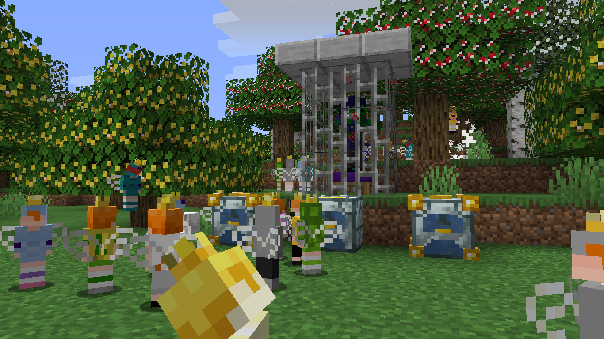

# 
- Back Math - June 5th Update -

### 
A Back Math Update Changelog made on *22/06/2024*

## Additions
- Added Queen Lucy Pet variants as a registry.
  - Currently does nothing, but the files are still generated with only the `asset_id` present.
  - Save folder is currently `queen_sophie_pet_variant`.
- Queen Lucy Summoner Staves have now been turned into the Mace (without enchantments).*[Methods taken from 1.21-pre1 using Yarn mappings]*
  - Now have 1500 durability, 10 attack damage, 0.6 attack speed*[Is this the correct attack speed?]* and 15 enchantability.
  - Can be repaired using any `#forge:ingots/obsidian`.
  - Makes smash particles (basically block breaking particles) and sounds when hitting an entity from more than 5 blocks up.
  - Can no longer break blocks while in Creative.

## Changes
- Crystallizer crystallizing sounds' volume is now halved.
- Crystalline Crystallizers no longer accept an empty main hand on a recipe.
- Updated some of the biome Aljan biome distribution.
- Changed the order of some items in the creative menu:
  - Golden Crowns now appear before Devil Crowns.
  - Green Apples now appear after Holy Jantiquified Aljame.
  - Moved molds around to match the order they appear in the Crystallizer.
  - Obsidian Infused Mid-Term related items now appear after Mid-Term items.
- Back Math spawn eggs and Queen Lucy Summoner Staves now use entity data from the `entity_tag` tag instead of `EntityTag`.
- Insomnia Zombies now properly convert to Drowned when underwater for some time, and can now be babies.
- Zombie Fabricios now can/have:
  - Convert to Drowned while underwater.
  - Be cured into Shy Fabricios using a Golden Apple while under the Blindness effect (Insomnia Potion).
  - Spawn as babies.
  - Stomp Turtle Eggs.
  - The *"Spawn Reinforcements Chance"* attribute.
- Wanderer Sophie's registry variant now works.
  - Now check on the Forge registry instead of the variant manager.
  - Random variants are now set properly.
  - Variants manager now tries to register unregistered variants, but currently fails. 
- Renamed template item model `handheld_thirty_two` to `handheld_32x`.
- Renamed item model `queen_sophie_summoner_staff_alt` to `queen_lucy_summoner_staff_3d`.

### Technical Changes
- Reorganized the entirety of *BMItemModelsProvider*.
- Moved all item models to the data generators. This only changes a few small things:
  - Angelic Crossbow models no longer have an extra line at the end.
  - Order of textures in notebooks is now different.
  - Mid-Term Bow models now extend `item/mid_term_bow` instead of `item/devil_bow`.
  - Milked Devil and Diamond Swords are no longer a separate texture (now use sword texture with overlay).
- Separated the Back Math spawn egg and Queen Lucy's Summoner Staff dispense behaviors into separate classes (*BMSpawnEggDispenseBehavior* and *QLSSDispenseBehavior*).
- Wanderer Sophies now validade their registry variant when reading the entity data.

## Tags
- Added `#melony:helps_on_zombie_conversion` block tag.
  - Contains all Beds and Iron Bars.
  - Blocks in this tag speed up the Zombie Fabricio to Shy Fabricio conversion process.
- Added `#backmath:eligible_to_capes` entity type tag.
  - Contains Wanderer, Warrior and (Archer) Insomnia Sophies, Queen Lucy and Archer and Karate Lucias.
  - Entities in this tag can have capes. This means the cape renders and the elytra takes the cape texture.
  - If not, the `cape` tag is not even loaded into the entity's NBT.