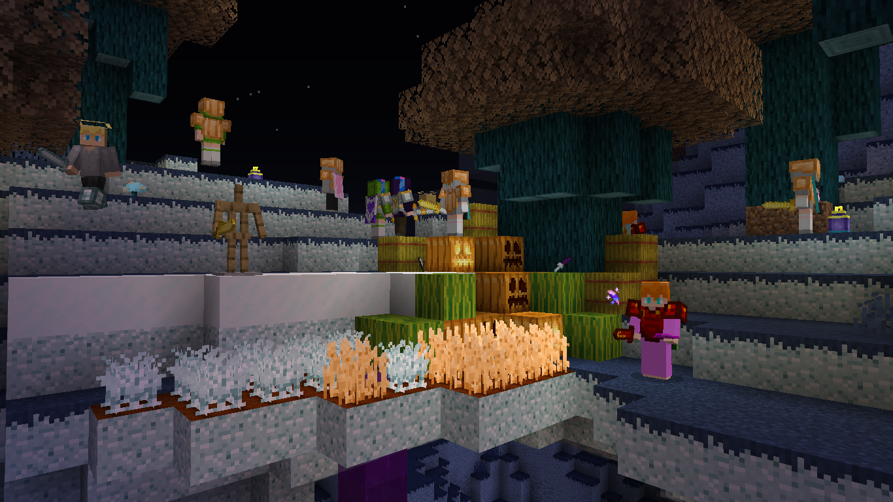

# 
- Back Math - May 23rd Update -

### 
A Back Math Update Changelog made on *05/06/2024*

## Additions
- Capes are no longer exclusive to Wanderer Sophies.
  - Now, Wanderer, Warrior and (Archer) Insomnia Sophies, Queen Lucy, Archer and Karate Lucias can have capes.
  - When they're using capes, Elytra now change their texture.
- Drops when cutting blocks with knives now use loot tables.
  - Stored in `backmath:loot_tables/gameplay/blocks`.
  - Now plays a hand swing animation when cutting.
- Added *"Set Stored Experience"* loot function.
  - Sets the `stored_experience` tag in Butter Swords with a random number between `min` and `max`.
- Added *"Termian Swim"*, *"Termian Splash"*, *"Termian High-Speed Splash"* and *"Lucia Celebrate"* sound events.

### Technical Additions
- Added a `butter_sword_test` loot table.
  - Only purpose was to test the new loot function.

## Changes
- Aljamic Farmland are now hydrated by `#backmath:hydrates_farmland` instead of `#minecraft:water`.
- Updated the textures of all Wanderer Sophies to use the two skin layers and to update the hair texture.
- Angry Sophies, (Archer) Insomnia Sophies, Insomnia Zombies and Zombie Fabricios no longer have a hardcoded head drop.
  - Queen Lucies are unaffected by this change.
- (Archer) Insomnia Sophies and Archer and Karate Lucias now have a celebration sound event for Sophie Raid (empty sound event).
  - These sound events are `backmath:entity.sophie.celebrate` and `backmath:entity.lucia.celebrate`.
- Wanderer, Warrior and (Archer) Insomnia Sophies, Queen Lucy and Archer and Karate Lucias now attack vexes and all entities in `#minecraft:raiders` entity type tag.
- (Archer) Insomnia Sophies and Archer and Karate Lucias now have their armor enchanted when spawned in a Sophie Raid.
- Queen Lucy now have animations.
  - As a result of this, her Queen Lucy Summoner Staff now properly spawns, and her crown is now actually an item on her head.
  - Her summoning mobs now plays the Evoker summoning animation.
- Queen Lucy now has an eye height of 1.62 blocks.
- Termian members now have player-like swim and (high-speed) splash sounds.
- Back Math biped mobs' arms now change model when the arms are set as slim (except for Queen Lucy Pets).
- Butter Sword experience points number is now colored `#80FF20` instead of green.
- Aljan and Anger Dungeons now check if their spawner entity type tag is empty before trying to set the mob.
  - If the tag **is** empty, they use a Sleepish Skeleton and Angry Sophie respectively.
- Obsidian Infused Mid-Term Crowns now have their texture applied.

### Technical Changes
- The `cape_texture` and `show_cape` tags from Wanderer Sophies have been removed.
  - Now, these tags have been renamed now put into a `cape` compound, and apply to all Termian members.
  - These tags were renamed to `texture` and `visible` respectively.
  - The Cherry Blossom Cape is still the default one.
- Back Math mob armor models now use a separate biped armor model.
- *BMBipedRenderer* now supports entity rotations for swimming and using Tridents with Riptide.
- Cleaned up the mob rendering classes.
- Renamed the *Purple Glitch* cape to *Purple Heart*, to be accurate with the cape's actual name.

## Tags
- Added `#backmath:sophie_allies` entity type tag.
  - Contains Wanderer, Warrior and (Archer) Insomnia Sophies, Queen Lucy, Archer and Karate Lucias and Malaikas.
  - Entities in this tag are not attacked if friendly fire happens between two mobs in this tag.
- Added `#backmath:hydrates_farmland` block tag.
  - Contains `#minecraft:water`.
  - Fluids in this tag can be used to hydrate Aljamic Farmland.
- Added `#melony:makes_grass_blocks_snowy` block tag.
  - Contains Snow Blocks and Snow (layers).
  - Blocks in this tag make Aljamic Grass Blocks and Avondalic Nylium snowy.