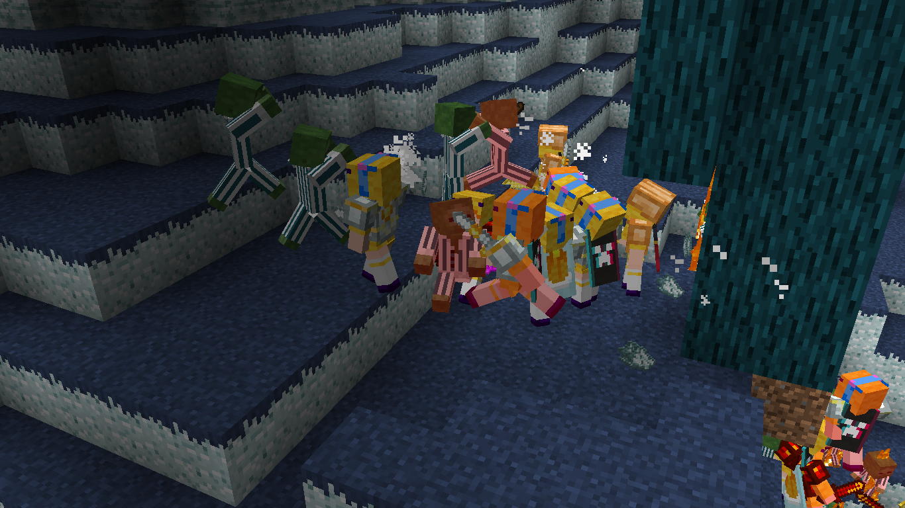

# <center>- Back Math - May 25th Update -</center>
### <center>A Back Math Update Changelog made on *05/06/2024*</center>

## Additions
- Wanderer Sophie variants are now data-driven. See **Wanderer Sophie Variants** category below.
- Insomnia Zombies can now be/spawn as babies.
  - Stored in a boolean tag called `is_baby`.
- Insomnia Zombies can(not) now convert to Drowned.
  - When they try to convert, the sounds are played, but the zombie doesn't convert, causing a lot of noise.
  - Stored in two integer tags called `ticks_submerged_in_water` and `drowned_conversion_ticks`.
- Insomnia Zombies now have the Spawn Reinforcements Chance attribute.

### Wanderer Sophie Variants
Wanderer Sophie Variants is a new registry added in this update. It controls what skins a Wanderer Sophie uses and whether they have slim arms (not yet implemented).
  - Will also include other things like cape visibility, glowing layers and others.
  - Registry name is `backmath:wanderer_sophie_variant`.
  - Currently is stil very broken (absolutely spams logs and only yellow axolotl variant exists?)
  - Stored as a string tag called `variant_reg` instead of replacing the existing integer `Variant` tag (for future compatiblity).
    - `variant_reg` is short for *"Variant from Registry"*.
  - Has an extra, data-only `steve` variant for testing purposes.

**JSON Format**:
- `"asset_id"`: A resource location with the name of this registry, like `backmath:blue_axolotl`. This is used to get the location for the textures, it being `"textures/entity/wanderer_sophie/<texture>.png"`.
- `"slim_arms"`: A boolean defining whether this variant has slim arms. True for all default variants. Currently does nothing.
- **Example**:

```json
{
  "asset_id": "backmath:yellow_axolotl",
  "slim_arms": true
}
```

## Changes
- Aljamic Farmland is now hydrated by `#melony:hydrates_farmland/water` fluid tag instead of `#minecraft:water`.
- Most if not all Termian members now sit in the correct position.
- Queen Lucy spawned by Sophie Raids now spawn with her crossbows enchanted (no difference as Sophie Raids aren't implemented yet). <sup>*[Where's my mi-i-i-i-ind?]*</sup>
- Queen Lucy's sound source is now "Hostile Creatures"; Was previously "Friendly Creatures". <sup>*[Fact check please]*</sup>

### Technical Changes
- All knife cutting loot tables have been moved from `gameplay/blocks` to `cutting`, and all files had their *"cutting"* prefix removed.
- Removed the `butter_sword_test` loot table.

## Tags
- Added `#melony:pickup_disallowed_predicate/chicken_jockey` item tag.
  - Contains Eggs.
  - Items in this tag cannot be picked up by chicken jockeys.
- Moved and renamed `#backmath:hydrates_farmland` fluid tag to `#melony:hydrates_farmland/water`.
  - Contains `#minecraft:water`.
  - Fluids in this tag can be used to hydrate water-based farmland, like Aljamic and Ender Farmland.