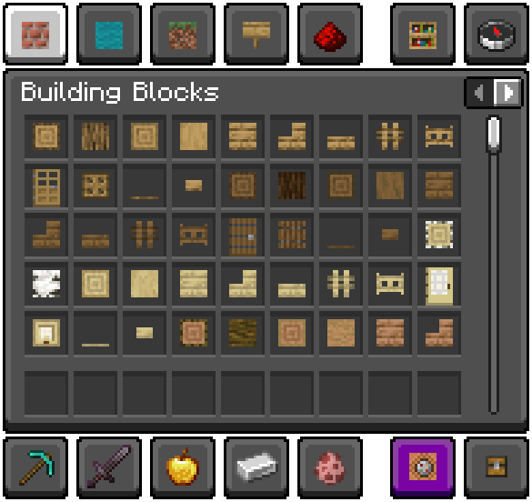

# Major Packs
## Flat Blocks
> *GitHub Page: [Fabricio20106/Flat-Blocks](https://github.com/Fabricio20106/Flat-Blocks)*

> *"Transforms inventory block models to item models!" - `pack.mcmeta` description*

Flat Blocks is a resource pack that makes block item models into flat textures, which is currently updated to **1.21.4** (as of 27/12/2024).

Currently, most blocks are accounted for, with some exceptions like coral and magma blocks.

> 
  

>
> **NOTE**: The different menu in this screenshot is from a resource pack called *Touched UI*.