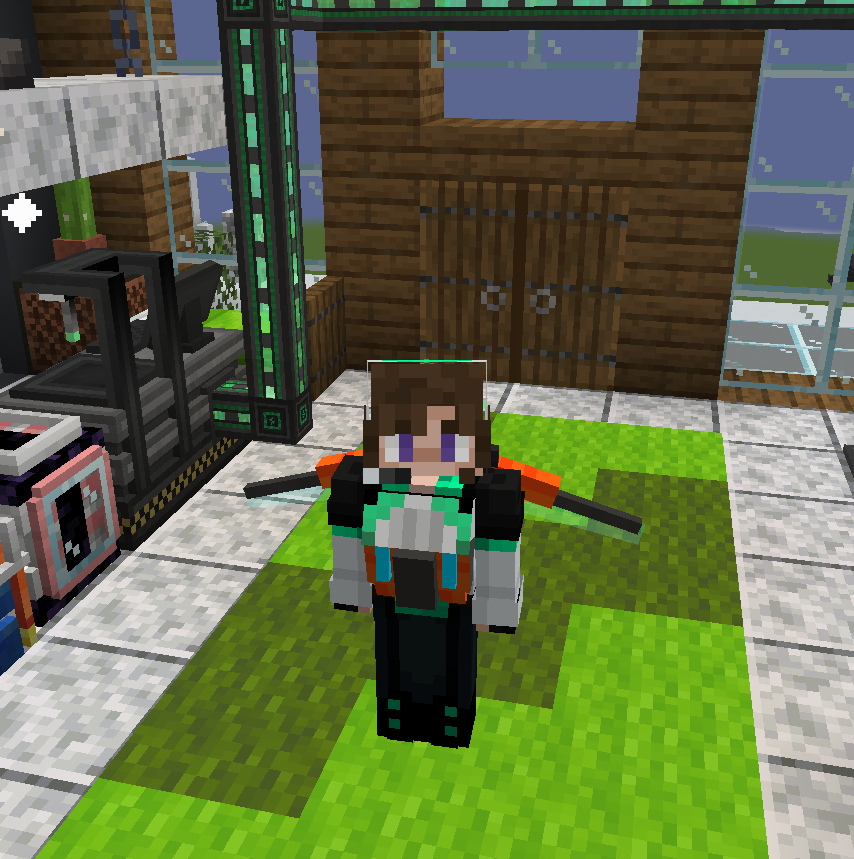
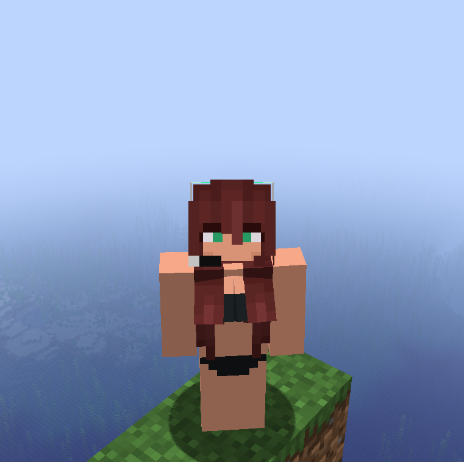

# Minor Packs
These are minor resource packs that either only fix under-the-hood things, or only change one or two small things.

## Create Interactive Fixes
> *"Fixes various translation errors in mods. (For Create: Interactive instance)" - `pack.mcmeta` description*
>
> **Target Version**: 1.18.2 (*Create: Interactive*)

This resource- and data pack fixes various small problems with blocks and items added by **Create: Interactive**, **Valkyrien Skies**, **Valkyrien Skies: Eureka!**, **L_Ender's Cataclysm** and **Mob Battles**, such as broken models, missing or incorrect translations and tagging issues.

> ### Create: Interactive
> - Fixed missing translations for the creative tab and blocks;
> - Fixed propagator bearing inventory model being wrong;
> - Added loot tables for all blocks;
> - Added propagator bearings to `#create:safe_nbt` block tag;
> - Added train buffer stops to `#create:tracks` block tag;
> - Added propagator (bearings) to `#minecraft:mineable/axe` block tag;
> - Added propagator (bearings) and train buffer stops to `#minecraft:mineable/pickaxe` block tag.

> ### Valkyrien Skies
> - Added proper translations for test spheres and ship assemblers;
> - Added a proper model for test spheres and ship assemblers;
> - Added recipes for test chairs, hinges and spheres (using `creatorshops` namespace);
> - Added loot tables for all blocks;
> - Added ship creators, small ship creators, ship assemblers and physics entity creators to `#forge:rods/wooden` item tag;
> - Added test hinges to `#minecraft:needs_stone_tool` block tag;
> - Added test chairs to `#minecraft:occludes_vibration_signals` block tag;
> - Added test hinges, wings, flaps and spheres to `#minecraft:mineable/pickaxe` block tag.

> ### Valkyrien Skies: Eureka!
> - Added proper translations for the creative tab;
> - Updated GUI textures for ship helms.

> ### L_Ender's Cataclysm
> - Fixed *many* typos and/or incorrect names;
> - Added translations for most subtitles, and fixed translation for the creative tab;
> - Added recipe for crafting an ignitium block into 9 ingots;
> - Added ignitium blocks to `#forge:storage_blocks/ignitium` block tag;
> - Added ignitium ingots to `#forge:ingots/ignitium` item tag;
> - Added the altar of fire to `#minecraft:dragon_immune` and `#minecraft:wither_immune` block tags;
> - Added all 3 music discs to `#minecraft:music_discs` item tag.

> ### Mob Battles
> - Changed the custom spawn egg translation to "Mob Spawn Egg".

## Meka Jetpack
> *"Changed the Armored Jetpack texture." - `pack.memta` description*
>
> **Target Version**: 1.18.2 (*Modern City*)

Changes the texture of the armored jetpack to match the chest of my "Formal June" skin. This is meant to match the aesthetic of breasts, and was made before I knew about **Female Gender Mod**.

> 
  

>
> Example screenshot taken using Formal Isabella instead of June.

## Skin Changes
> *"A" - `pack.mcmeta` description (very descriptive, I know)*
>
> **Target Version**: 1.20.2 (*Fabric Tests - 1.20.2*)

Changes the default Efe skin for a variant of Formal June with long red hair in a black bikini. This was meant for use with **Female Gender Mod**.

> 
  
