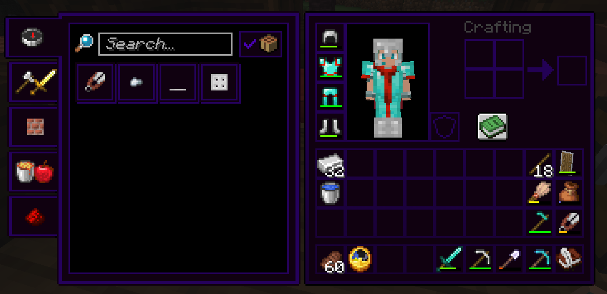
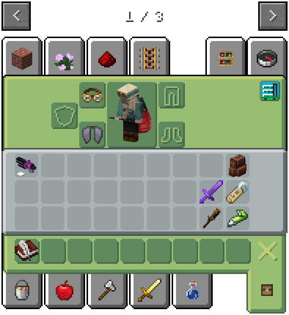
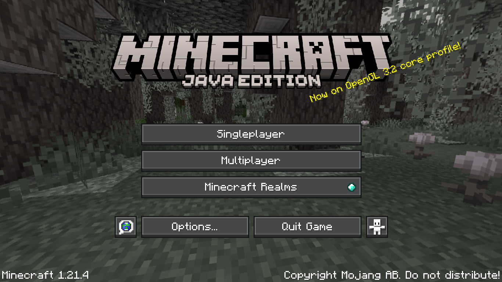
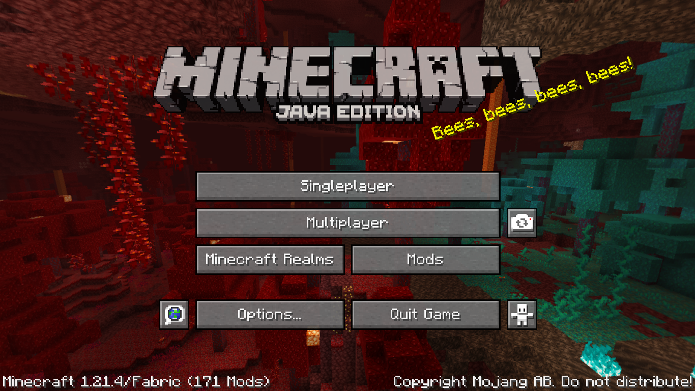
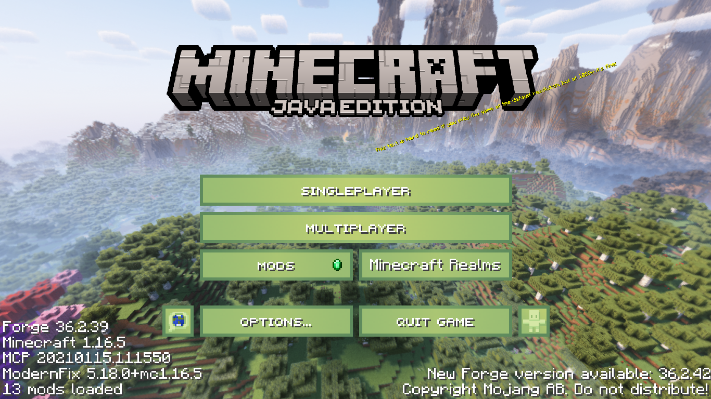
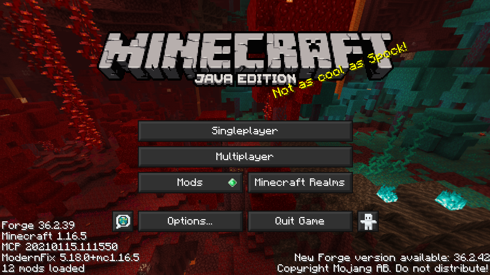

# UI Packs
These are resource packs of mine that update the game's UIs.

## Tooltip UI [*unofficial name*]
This pack updates most of the game's UIs to match that of the tooltip background texture (before it was even a texture).

As the tooltip background is a dark purple color, this pack ends up having dark mode UI. 

> 
  

## Melony UI [*unofficial name*]
> **This pack has not been oficially released yet**
>
> The screenshot in the example picture is just the menu photoshopped onto a screenshot of Create Trains & Coffee. 

This unreleased pack aims to update the game's UIs to feel cleaner.

The main color palette for this pack are the Melony green and white. The creative inventory tab also has a simple profile icon on the top right, albeit useless.

> 
  

## Ore UI
> *"Adds some of OreUI's elements to Java Edition." - `pack.mcmeta` description*
>
> **Target Versions**: 24w11a - 1.21.3

This pack updates the default button textures to look like the Ore UI buttons in *Bedrock Edition*.

It also updates the tooltip background to look more like these buttons.
> 
  

## Nether Update
> *"Backports some UI features from 1.16." - `pack.mcmeta` description*
>
> **Target Version**: 1.21.4

This pack replaces the menu panorama with the panorama from the Nether Update, and the *Minecraft* logo and subtitle with the ones from pre-1.20.5.

> 
  

## J10SME Utils - Resources
> *"Small texture & translation changes for J10SME. (built-in)" - `pack.mcmeta` description*
>
> **Target Version**: 1.16.5 

This pack is mainly focused on fixing things in mods for *Mellomedley*, but it does also update the game's UI.

It makes buttons a bright (melony) green, and some of the text in said buttons is in small caps.
> 
  

## Mellow UI (Dark)
> *"Makes all UIs and HUDs dark. For Mellomedley." - `pack.mcmeta` description*
>
> **Target Version**: 1.16.5

Makes most interfaces and buttons in the game use a dark gray and melony lime color palette.

This pack is the intended successor for the current UI pack being used in *Mellomedley*.
> 
  
