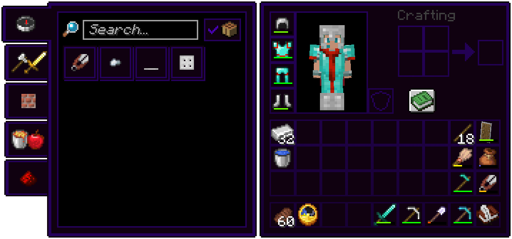

# UI Packs
These are resource packs of mine that update the game's UIs.

## Tooltip UI [*unofficial name*]
This pack updated most of the game's UIs to match that of the tooltip background texture (before it was even a texture).

As the tooltip background is a dark purple color, this pack ends up having dark mode UI. 

> 
  

## Melony UI [*unofficial name*]
> **This pack has not been oficially released yet**
>
> The screenshot in the example picture is just the menu photoshopped onto a screenshot of Create Trains & Coffee. 

This unreleased pack aims to update the game's UIs to feel cleaner.

The main color palette for this pack are the Melony green and white. The creative inventory tab also has a simple profile icon on the top right, albeit useless.

> 
  
