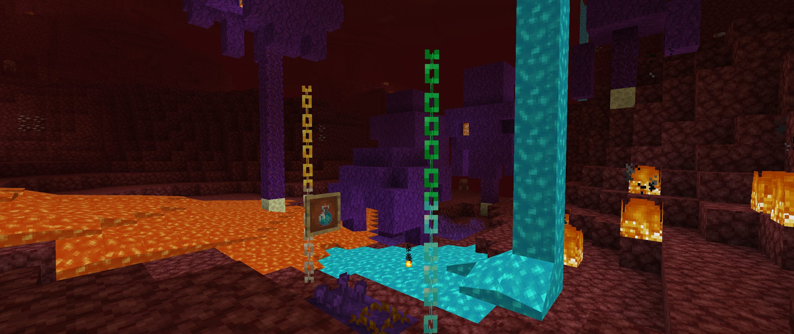

# <center>- Variants - 1.6.11 -</center>
### <center>A Variants Release Changelog made on *22/11/2023*</center>

## Additions
- Added Enderwood.
  - Currently, it does not spawn naturally.
  - Has most wood-related blocks, including Bookshelves.
- Added Ender Roots, End Sprouts, Ender Fungus, Ender Wart and Warping Vines.
- Added Ender Nylium and Ender Farmland.
- Added Soul Lava Bottles
- Added ```#variants:farmland``` block tag.
  - Contains ```minecraft:farmland``` and ```variants:ender_farmland```.
  - Used by Variants' plants to determine whether they can be placed on this block.
- Added a new pack.png for Variants.
- Red Nether Bricks can now be crafted from Red Nether Bricks (item).
- End Sprouts and Warping Vines have a 50% chance to fill a Composter.
- Ender Roots and Ender Fungi have a 65% chance to fill a Composter.
- Ender Wart Blocks have an 85% chance to fill a Composter.
- Soul Lava now generates naturally in the Nether (changeable through configs).
- Soul Lava now flows as far and as fast as normal lava.

## Changes
- Changed textures of Quartz, Gold and Diamond Chains.
- Updated Variants' wide logo to match the new pack.png logo.
- Fletchers now buy 32 Enderwood Sticks for 1 Emerald.
- Attempted to fix drinkable containers not giving the empty container item. 