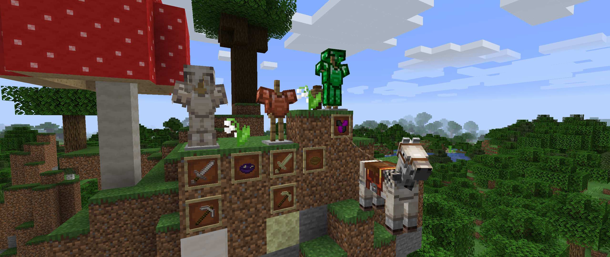

# <center>- Variants - 1.6.12 -</center>
### <center>A Variants Release Changelog made on *23/11/2023*</center>

## Additions
- Added Quartz Armor, Horse Armor and Tools.
- Added Emerald Armor.
- Added Copper Chestplates.
- Added bowls of all wood types: Oak, Spruce, Birch, Jungle, Acacia, Dark Oak, Painting, Crimson, Warped and Enderwood.
- Added a new *"Glitch"* item model for Wool Sweaters.
    - This is a test to add customizable sweater variants.
- Added an End Stone tool set.
- Added End Fungi Stews, made with Ender Fungi.

## Changes
- Wool Sweaters now have an ```armor_design``` integer tag that defines its design. 
    - Armor models will eventually have their model changed as well, but due to my current knowledge, I couldn't find a way to change the armor models dynamically.
- Updated textures of Rails, Powered Rails, Detector Rails and Activator Rails.
- Updated texture of Iron Nuggets.