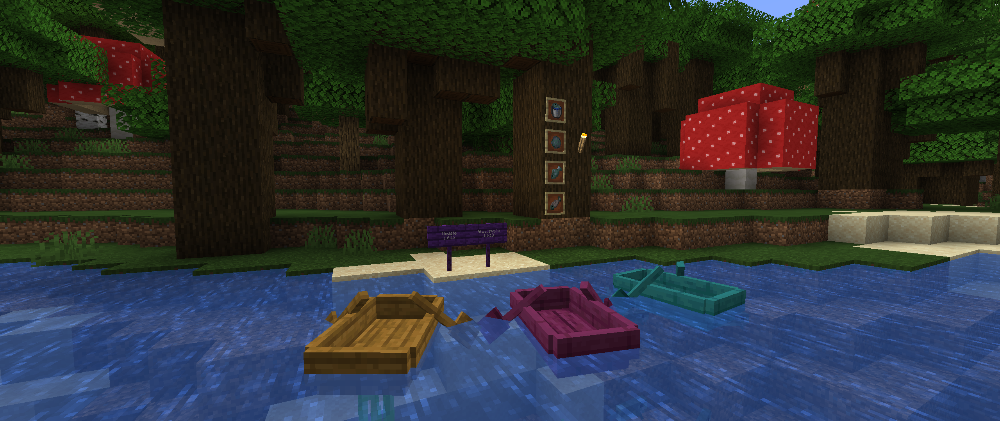

# <center>- Variants - 1.6.13 -</center>
### <center>A Variants Release Changelog made on *26/11/2023*</center>

## Additions
- Added Enderwood Signs.
- Added Painting, Crimson and Warped Boats.
- Added Fish (Old Cod), including Raw Fish, Cooked Fish, Fish Bucket and Fish Spawn Egg.
- Added config to control whether Fish should spawn naturally (```fishSpawning```).

## Changes
- Soul Lava now has an overlay texture (but it's not actually used).
- Added block state definitions and block models for Soul Lava.
- Ender Nylium can now be tilled (turned into farmland).
- Painting wood set, Enderwood wood set, Ender vegetation and Glow Black Wool and Carpet can now burn.
- Added Brazilian Portuguese translations for last build's items.