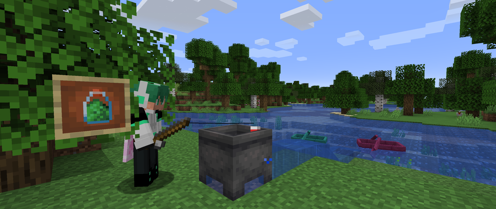

# <center>- Variants - 1.6.14 -</center>
### <center>A Variants Release Changelog made on *06/12/2023*</center>

## Tags
- Added ```#variants:catlike_tame_items``` item tag.
    - Contains ```minecraft:cod```, ```minecraft:salmon``` and ```variants:old_cod```.
    - Determines what items can be used to tame Cats and "passify" Ocelots.
- Added ```variants:bowls/obtainable_through_fishing``` item tag
  - Contains ```minecraft:bowl```, ```variants:oak_bowl```, ```variants:spruce_bowl```, ```variants:birch_bowl```, ```variants:jungle_bowl```, ```variants:acacia_bowl```,
        ```variants:dark_oak_bowl``` and ```variants:painting_bowl```.
- Added ```#variants:bowls/wooden``` item tag.
  - Contains all the above and ```variants:crimson_bowl```, ```variants:warped_bowl``` and ```variants:ender_bowl```.
- Added ```#forge:rods/obtainable_through_fishing``` item tag.
  - Contains ```minecraft:stick```, ```variants:oak_stick```, ```variants:spruce_stick```, ```variants:birch_stick```, ```variants:jungle_stick```, ```variants:acacia_stick```,
    ```variants:dark_oak_stick``` and ```variants:painting_stick```.

## Changes
- Fish (old cod) can now be obtained from fishing.
- Bowls and Sticks from loot table ```gameplay/fishing/junk``` can now be any wood type from the Overworld.
- Renamed "Creeperpowder Pot" to "Explosive Blend Pot", and changed texture accordingly
  - Also applies to the poisoning effect icon.
- Trying to use Debug Bows in survival, adventure or spectator mode now shows a new tooltip: ```Cannot change block states in Survival/Adventure/Spectator Mode```.

## Bug Fixes
- Crimson and Warped Boats no longer turn into Painting Boats when reloading the world.
- Cauldrons no longer generate waterlogged in village houses and igloos
  - They still generate waterlogged in some rooms in Woodland Mansions.
- Fixed a mixin-related crash that could occur on servers.