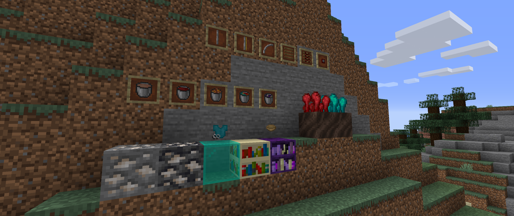

# <center>- Variants - 1.6.16 -</center>
### <center>A Variants Release Changelog made on *13/12/2023*</center>

## Additions
- Added Stew/Soup Buckets.
- Added Iron/Powered/Corner Iron Ties, Wooden/Powered Railbeds and Detector Plates.
    - Can be used to make all rail types (vanilla rails, that is).
- Added a new Infinity Sweaters item tab.
    - Can be enabled through configs.
    - The quantity of sweaters and the color spacing can also be configured.
    - Comes with a new item for the tab icon.
- Added Exponential Mushroom Stew (hidden from inventory).
    - These "exponential" stews/soups can have their container item and the bowl on the texture specified through NBT data and model predicates.
- Most Stained Glass (and Quartz Glass) now show their beacom beam color on the tooltip.
- Variants' bookshelves now show their enchanting power on the tooltip.
- Variants' ores now show how much experience they drop on the tooltip.
- Added a recipe for Variated Instructions book.

## Changes
- Various models have been moved to the Data Generators.
- Updated the descriptions of enchantments (can be disabled through configs).
    - Enchantments now display the category of item it can be applied to.
- Nether Wart can now be planted on any block tagged as ```#variants:nether_wart_plantable_on```.
- Variants' weapons tab icon is now a random color Wool Sweater (picked randomly every world load).
- Wither Skeletons now drop Wither Bones (same count and chance as regular bones).
- Nether Wart can now be grown by Bees.

## Tags
- Renamed tag ```#variants:warped_wart_plantable_on``` to ```#variants:nether_wart_plantable_on```.
- Added ```#forge:crops``` item tag.
    - Contains ```#forge:crops/golden_carrot```, ```#forge:crops/warped_wart``` and ```#forge:crops/ender_wart```. (contents of these tags are self-explanatory).
- Added ```#variants:bowl_foods``` item tag.
    - Contains ```#variants:bowl_foods/mushroom```, ```#variants:bowl_foods/beetroot```, ```#variants:bowl_foods/rabbit```, ```#variants:bowl_foods/fungi```, ```#variants:bowl_foods/end_fungi``` and  ```#variants:bowl_foods/aljan_fungi```.
- Added Deepslate from Vanilla, Caves & Cliffs: Backport and Quark to ```#forge:deepslate_replaceables``` block tag.
- Added Nether and Ender Wart to ```#minecraft:crops``` block tag.
- Added Aljamic Farmland (Back Math) to ```#variants:farmland``` block tag.
- Added Book of Regular/Advanced Molds (Back Math), Guide Book (Patchouli) and Quest Book (FTB Quests) to ```#variants:books``` item tag.
- Added Devil, Angelic, Mid-Term, Aljameed and Moonering Shields (Back Math) to ```#variants:shields``` item tag.