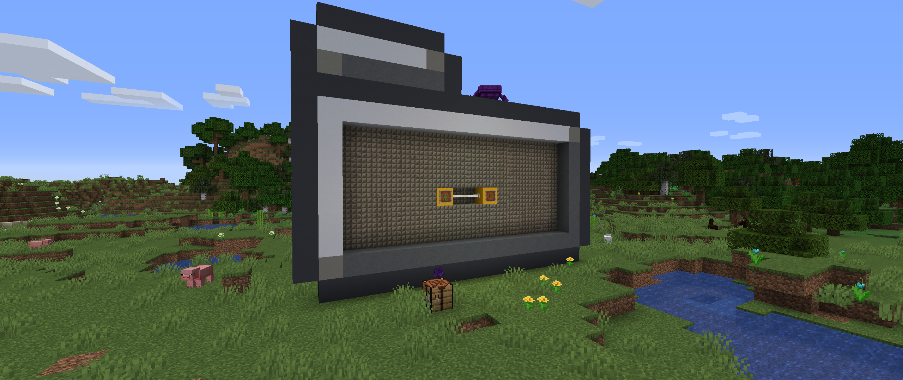

# <center>- Variants - 1.6.17.1 -</center>
### <center>A Variants Release Changelog made on *28/12/2023*</center>

Release 1.6.17.1 was release as a hotfix update for last releases' occuring crash, and bugs found due to lack of testing.

## Additions
- Added "Variants" and "Recycling Textures" advancements.
    - "Variants" requires the player to get a Glow Black Tulip, a Painting Log or Painting Sapling.
    - "Recycling Textures" requires the player to get Painting Planks.
        - This advancement does now show up due to a random comma.
        - This advancement lacks a Brazilian Portuguese translation in this release.
    - The background of the advancements tab is a Dark Elder Prismarine.
- Added a recipe for Enderwood Boats.

## Changes
- Enderwood Boat item now has a model.

## Tags
- Added Enderwood Boats to ```#minecraft:boats``` item tag.