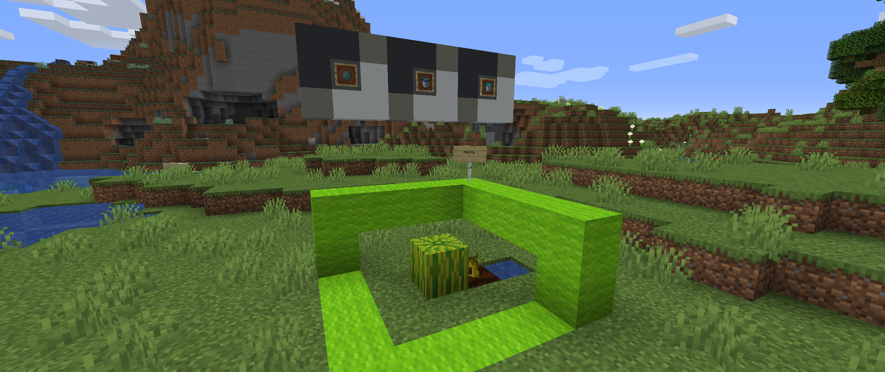

# <center>- Variants - 1.6.17.2 -</center>
### <center>A Variants Release Changelog made on *28/12/2023*</center>

## Changes
- Buckets of Fish and Soul Lava Buckets now appear after Fish Spawn Eggs in the creative tab.
- "Recyling Textures" advancement now shows up the advancements tab.
- Variants' patchouli book "Variated Instructions" <sup>*[renamed to "Varied Instructions on 1.6.20.2"]*</sup> now appear in Variants' main tab (**if** it shows up).

### Translation Changes (Brazilian Portuguese)
- Added translation for advancement "Recycling Textures".

## Tags
- Added Enderwood Bookshelves to ```#forge:bookshelves``` item tag.
- Changed the mod id of these block tags to ```melony```:
    - ```#forge:deepslate_replaceables```;
    - ```#variants:conduit_frame_blocks```;
    - ```#variants:farmland```.
- Changed the mod id of these item tags to ```melony```:
    - ```#variants:books```;
    - ```#variants:bookshelves```;
    - ```#variants:bowls```;
    - ```#variants:bowls/wooden```;
    - ```#variants:bowls/obtainable_through_fishing```;
    - ```#variants:catlike_tame_items```;
    - ```#variants:shields```.