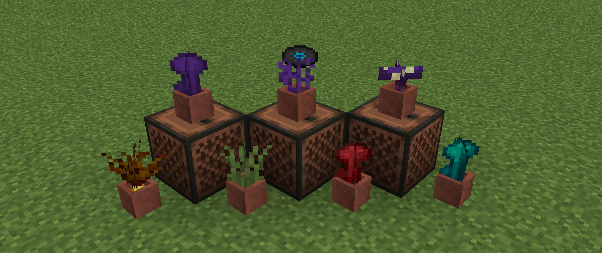

# <center>- Variants - 1.6.18 -</center>
### <center>A Variants Release Changelog made on *21/01/2024* (yes, the first changelog of 2024)</center>

## Additions
- Added Potted Grass, Golden Carrots, Nether Wart, Warped Wart and Ender Wart.
- Added item forms for Potted Ender Roots and Fungus.
    - Includes recipes.
- Added different sound events for equipping Variants' armors.
    - But these are unused by the armors since the game crashed when using these.

## Changes
- Fish (Old Cod) flopping, ambient, death and hurt sounds now have their own subtitles.
- Fishermen can now sell Buckets of Fish for 3 Emeralds, and buy 15 Raw Fish for 1 Emerald.
- Golden Carrots (item) no longer has a rarity of "uncommon".
- Fishing drinking a soup/stew bucket no longer produces an eating sound.

## Bug Fixes
- [VS-2](https://github.com/Fabricio20106/Variants/issues/2) - Music disc "dog" play globally.

## Tags
- Added Enderwood Bookshelves to ```#forge:bookshelves``` item tag.
- Added Potted Golden Carrots and Powered Ties to ```#minecraft:piglin_loved``` item tag.
- Added ```#minecraft:lectern_books``` item tag to ```#melony:books```.
- Added all new potted plants to ```#minecraft:flower_pots``` block tag.
- Added ```#vaiants:flower_pots``` item tag.
    - Contains all Variants flower pots.