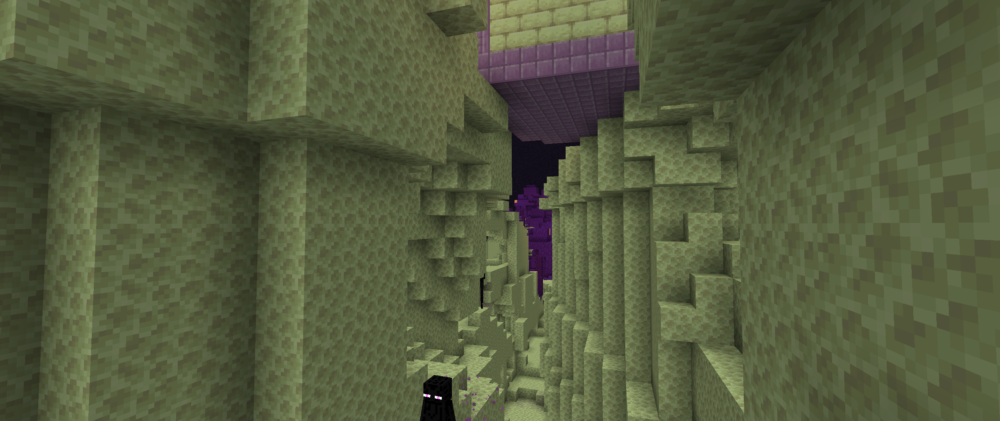
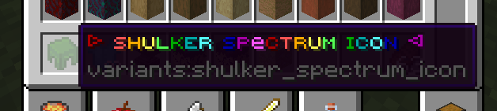
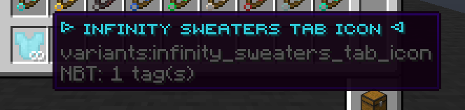

# <center>- Variants - 1.6.19.1 -</center>
### <center>A Variants Release Changelog made on *09/02/2024*</center>

## Additions
- Added Ender Nylium Quartz Ore.
    - Generates on Ender Nylium on the End.
- Added Caves and Ravines to the End.
    - Comes with a ```generateEndCavesAndRavines``` config to toggle it on and off.
- Added Diamond and Emerald Shards.
- Added a custom icon item for ```"The Shulker Spectrum"``` advancement.
    - 
    - This is a shulker shell that cycles through all other shulker shell colors.
    - Has epic rarity, doesn't burn and does not show up in the creative menu.
    - They have a rainbow name with "custom" font: "▷ ꜱʜᴜʟᴋᴇʀ ꜱᴘeᴄᴛʀᴜᴍ ɪᴄᴏɴ ◁".
- The name color of Infinity Sweater Tab Icons is now `#31CCDD`.
    - 
    - They also now have a default durability of 80.
    - Their name is now "▷ ɪɴꜰɪɴɪᴛʏ ꜱᴡᴇᴀᴛᴇʀꜱ ᴛᴀʙ ɪᴄᴏɴ ◁".

## Changes
- Elder Sea Lanterns no longer use emissive rendering *(still don't know what it did)*.
- Blocks of Raw Debris now use **"COLOR_BROWN"** on maps instead of **"COLOR_BLACK"**.
- Updated config descriptions for ```generateFlowerPatches```, ```generateQuartzOre```, ```generateEndQuartzOre``` and ```enableInfinitySweatersTab```.
- When Soul Lava comes in contact with a water source, **it will now create Blackstone instead of Cobblestone**.
- End Cities can now generate in Enderwood Forests.
- End Quartz Ore can now replace any ```#forge:end_stones```, instead of only End Stone.
- Renamed advancement ```A Slight Better Meal``` to ```A Slightly Better Meal```.
- Swapped the "[...] and gives Glowing" description from Gunpowder Poisoning to Glowstone Poisoning.
- Changed a single miscolored pixel on the Cyan Shulker Shell.
- All recipes that used items from other mods now have a "mod loaded" condition.
- Golden Beacons can now be crafted using any ```#melony:nether_stars```, instead of only Nether Stars.
- Effect providers for JEED now work (changed mod id to "variants").
- Magentic Crystal Shears are now crafted using ```#forge:gems/magentic``` item tag.
- ```It's Never Coming``` advancement is now a goal.
- ```The Shulker Spectrum``` advancement is now a challenge.
- ```A Sticky Sweet``` advancement is no longer hidden.
- ```It's Now a Machine Gun...``` advancement is now available, and its parent is now ```You're Hacking!```.
    - It's also now obtainable with a Quick Charge V Enchanted Knowledge Book.
- Powder Snow Bottles now require 4 glass bottles to be crafted, and now yield 4 powder snow bottles.
    - Can also be crafted using Creeper Powder Snow Buckets now. <sup>*(from Creeper Edits)*</sup>

### Translation Changes (Brazilian Portuguese)
- Renamed tab "Variants: Suéteres infinitos" to "Variants: Suéteres Infinitos".
- Renamed advancement "Reciclando texturas" to "Reciclando Texturas".
- Renamed Enderwood Forest from "Floresta de madeira do End" para "Floresta Enderwood".
- Added translations for all 33 new advancements added in 1.6.19.
- Added translations for all effect descriptions.

## Tags
- Added ```#melony:icon_items``` item tag.
    - Contains Infinity Sweater Tab Icon and SHulker Spectrum Icon.
- Added ```#melony:nether_stars``` item tag.
    - Contains Nether Star.
- Added ```#variants:end_carver_replaceables``` block tag.
    - Contains ```#forge:end_stones``` and Ender Nylium.
- Added ```#forge:nuggets/diamond``` and ```#forge:nuggets/emerald``` item tags.
    - Contains Diamond Shard and Emerald Shard respectively.
- Added ```#forge:tools/hoes``` item tags.
    - Contains all vanilla hoes and Variants' hoes.
- Added Ender Nylium Quartz Ore to ```#forge:ores/quartz``` block and item tags.
- Added Ender Nylium Quartz Ore to ```#minecraft:dragon_immune``` and ```#minecraft:nylium``` block tags.
- Added ```#variants:soul_lava``` fluid tag.
    - Contains Soul Lava and Flowing Soul Lava.
- Removed Soul Lava and Flowing Soul Lava from ```#minecraft:lava``` fluid tag, and added ```#variants:soul_lava``` instead.
- Added ```#forge:end_stones``` block tag to ```#variants:chorus_flower_plantable_on```, removing End Stone.
    - Added Ender Nylium Quartz Ore to this tag.
- Added ```#forge:end_stones``` block tag to ```#variants:end_plants_plantable_on```, removing End Stone.
- Added ```#forge:end_stones``` block tag to ```#variants:ender_wart_plantable_on```, removing End Stone.
    - Added Ender Nylium Quartz Ore to this tag.
- Added ```#forge:end_stones``` block tag to ```#variants:warping_vines_feature_can_place_on```, removing End Stone.