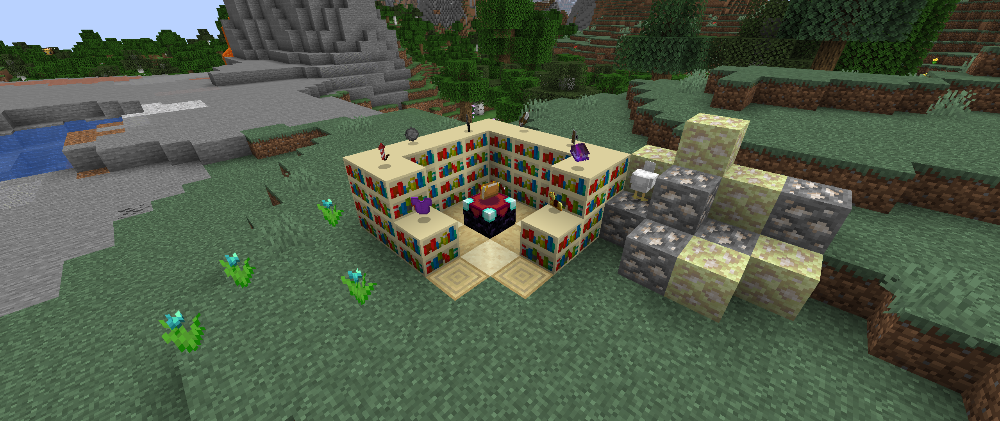

# <center>- Variants - 1.6.7 -</center>
### <center>A Variants Release Changelog made on *18/11/2023*</center>

## Additions
- Quick Charge enchantment can now go up to 5.
- Added configuration files for Variants:
    - **(Mixin)**: Display the custom Firework Rocket and Star descriptions.
    - **(Mixin)**: Display how many armor points does Horse Armor give.
    - **(Mixin)**: If any Shears can be enchanted at an Enchantment Table.
    - **(Mixin)**: If any Flint and Steel can be enchanted at an Enchantment Table.
    - **(Mixin)**: If any Shield can be enchanted at an Enchantment Table.
    - **(Mixin)**: If Quick Charge can go up to 5.
    - **(World Generation)**: Generate Glow Black Tulip flower patches.
    - **(World Generation)**: Generate Quartz Ore in the Overworld.
    - **(World Generation)**: Generate End Quartz Ore in the End.
    - **(Items)**: If the game should add all default colors of Wool Sweater to the Variants creative tab.

## Changes
- Firework Rocket and Firework Stars now have their item stack set to "Variants".

## Technical Changes
- Renamed tag ```DebugProperty``` in Debug Bows to ```debug_property```.