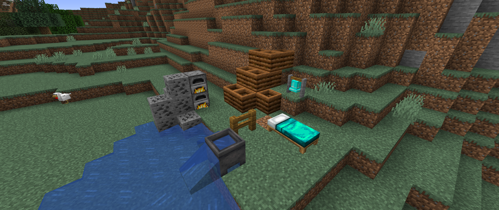

# <center>- Variants - 1.6.8 -</center>
### <center>A Variants Release Changelog made on *14/11/2023*</center>

## Additions
- Glow Black Beds and Diamond Bells now render their 3D model properly.
- Coal Shears can now be burned -- they last for 3.200 ticks and smelt 16 items.
- Honey Balls can now be crafted from Honey Blocks.
- Honey Blocks can now be crafted with Honey Balls.
- Added recipe for Bells *(similar to the Diamond Bell recipe)*.
- Many items from Variants are now compostable:
    - Painting Saplings, Painting Leaves and Glow Berry Bushes have a 30% chance to fill a Composter.
    - Warped Wart, Glow Black Tulips, Golden Carrots (crop) and Golden Carrots (item) have a 65% chance to fill a Composter.

## Changes
- Plasteel Shears now appear before Diaemerald Shears in the creative menu.
- Cauldrons can now be waterlogged.
- Enchanted Knowledge Books are now crafted at Smithing Tables (to keep the enchantments).
- Glow Black Beds now appear in the creative menu.
- Added recipe for Glow Black Beds.
- The model of Painting Fences in the inventory now uses the new painting plank texture.

## Tags
- Added ```#variants:shields``` item tag.
    - Contains Shields and Empty Armor Slot Shields.
- Added Alice's AI Shears to the ```#minecraft:piglin_loved``` item tag.
- Added Enchanted Knowledge Books to the ```#variants:books``` item tag.