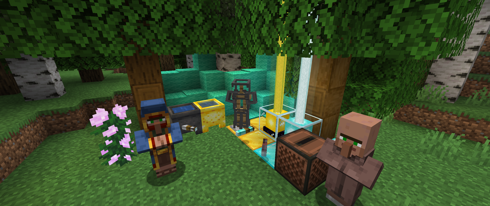

# <center>- Variants - 1.6.9 -</center>
### <center>A Variants Release Changelog made on *19/11/2023*</center>

## Additions
- Spyglasses are now "usable" -- they still don't zoom in or show the correct holding pose.
- Many items from Variants are now available from Villagers, some of which weren't obtainable before (see table below).

## Changes
- Changed block textures of Painting Log/Wood, Stripped Painting Log/Wood and Glow Black Wool.
- Changed item textures of Oak/Spruce/Birch/Jungle/Acacia/Dark Oak/Painting/Crimson/Warped Sticks and Raw Debris.
- Dog music disc file is now smaller.

## Tags
- Added ```#variants:beacons``` item tag.
  - Contains Beacons and Golden Beacons.
- Added ```#variants:cauldrons``` block and item tags.
  - Contains Cauldrons and Golden Cauldrons.
- Added ```#forge:armors/boots``` item tag.
  - Contains Empty Armor Slot Boots.
  - This is used by Back Math on the Book Pack recipe.

## Technical Changes
- Added a translation for ```null```.
- Added ```pickRandomColor(Item)``` method on WoolArmorItem, used by the Shepherd's Wool Sweater trade.

## Villager Trade Tables for Variants' Items
| Villager Level   | Profession       | Buys                    | Sells                                    |
|------------------|------------------|-------------------------|------------------------------------------|
| Apprentice (2)   | Armorer          | 36 Emeralds             | 1 Diamond Bell                           |
| Apprentice (2)   | Armorer          | 1 Emerald               | 1 Empty Armor Slot Boots                 |
| Apprentice (2)   | Armorer          | 1 Emerald               | 1 Empty Armor Slot Leggings              |
| Journeyman (3)   | Armorer          | 1 Emerald               | 1 Empty Armor Slot Helmet                |
| Journeyman (3)   | Armorer          | 4 Emeralds              | 1 Empty Armor Slot Chestplate            |
| Journeyman (3)   | Armorer          | 5 Emerald               | 1 Empty Armor Slot Shield                |
| Apprentice (2)   | Cartographer     | 11 Quartz Glass Pane    | 1 Emerald                                |
| Master (5)       | Cleric           | 22 Warped Wart          | 1 Emerald                                |
| Novice (1)       | Fletcher         | 32 Variants wood sticks | 1 Emerald                                |
| Master (5)       | Fletcher         | 48 Emeralds             | 1 Enchanted Debug Bow                    |
| Novice (1)       | Librarian        | 9 Emeralds              | 1 Plain Birch Bookshelf                  |
| Journeyman (3)   | Librarian        | 1 Emerald               | 4 Quartz Glass                           |
| Apprentice (2)   | Shepherd         | 12 Glow Black Dye       | 1 Emerald                                |
| Apprentice (2)   | Shepherd         | 1 Emerald               | 1 Glow Black Wool                        |
| Apprentice (2)   | Shepherd         | 1 Emerald               | 4 Glow Black Wool                        |
| Journeyman (3)   | Shepherd         | 3 Emeralds              | 1 Glow Black Bed                         |
| Journeyman (3)   | Shepherd         | 2 Emeralds              | 1 Random color Wool Sweater              |
| Journeyman (3)   | Shepherd         | 4 Emeralds              | 1 Rabbit Hide Tunic                      |
| Journeyman (3)   | Shepherd         | 4 Emeralds              | 1 Phantom Membrane Tunic                 |
| Master (5)       | Shepherd         | 2 Emeralds              | 2 Painting Doors (Wanderer/Graham/First) |
| Novice (1)       | Toolsmith        | 1 Emerald               | 1 Diorite/Granite/Andesite Axe           |
| Novice (1)       | Toolsmith        | 1 Emerald               | 1 Diorite/Granite/Andesite Shovel        |
| Novice (1)       | Toolsmith        | 1 Emerald               | 1 Diorite/Granite/Andesite Pickaxe       |
| Novice (1)       | Toolsmith        | 1 Emerald               | 1 Diorite/Granite/Andesite Hoe           |
| Apprentice (2)   | Toolsmith        | 36 Emeralds             | 1 Diamond Bell                           |
| Apprentice (2)   | Toolsmith        | 3 Emeralds              | 1 Magma Sword                            |
| Apprentice (2)   | Weaponsmith      | 36 Emeralds             | 1 Diamond Bell                           |
| Journeyman (3)   | Weaponsmith      | 12 Emeralds             | 1 Iron Spyglass                          |
| Wandering Trader | Wandering Trader | 5 Emeralds              | 1 Painting Sapling                       |
| Wandering Trader | Wandering Trader | 1 Emerald               | 1 Glow Black Tulip                       |
| Wandering Trader | Wandering Trader | 1 Emerald               | 3 Glow Black Dyes                        |
| Wandering Trader | Wandering Trader | 5 Emeralds              | 1 Glow Berry Bush                        |
