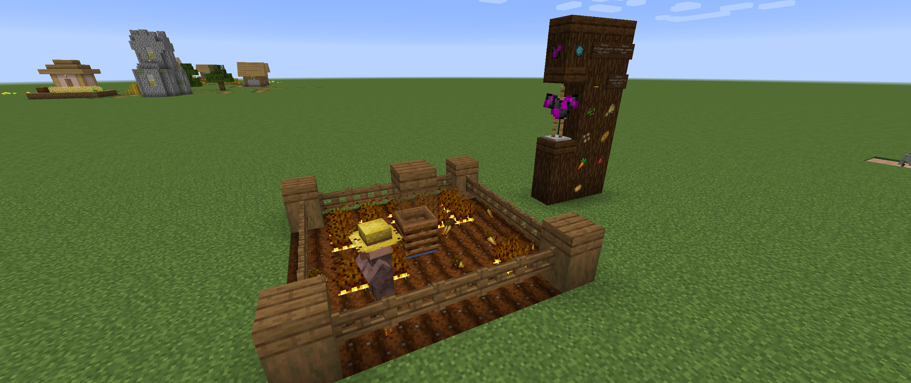

# 
- Variants - 1.7.0 Pre-Release 2 -

### 
A Variants Release Changelog made on *19/03/2024*

## Additions
- Added Wool Armor Designs (currently only one exists, the Glitch design)[^1].
- Wool armor designs can now appear on the Weaponry tab.
- Added `populateWoolArmorDesignsInTabs` and `maxInTabWoolArmorDesigns` configs.
  - These control whether to add all wool armor designs to the creative menu, and how many should be added.
- Milk Bottles can now be crafted from Creeper Milk Buckets (from Creeper Edits).

### Wool Armor Designs
*Documentation: [Wool Armor Docs](https://github.com/Fabricio20106/Informational-Mod-Features/blob/main/Variants/Docs/Wool%20Armor.md)*

Wool Armor Designs is a feature fully added in this version. This allows you to fully customize wool armor models with just a NBT tag called `armor_design`.

If you're adding your own designs, you will need to add the translation (`"tooltip.<modid>.wool_armor_design.<your design>"`), and the armor model (`"wool_layer_1/2_<your design>.png"`).

## Changes
- Exponential Water and Lava Bowls now only grants 1 nutrition and 1 saturation.
- Exponential Milk Bowls now grants 4 nutrition and 5 saturation.
- Villagers can now pick up Golden Carrots (crop).
- Villagers can now plant[^2] crops in `#melony:villager_plantable_seeds` item tag.
- Updates textures for:
  - Dog Music Disc;
  - Soul Charges;
  - Glitch Design Wool Sweater.
- Splash Soph Potions, Dragon Breath, Experience Bottles and Glass Bottles now accept any `#forge:dusts/gunpowder` instead of only Gunpowder (no in-game difference).
- Renamed Fish texture file from `old_cod.png` to `fish.png`.
- The recipe for the Varied Instructions guide book now works again.
- Removed *"Double Closed Soul Lava Spring"* configured feature.
- Removed *"Enderwood Forest Wart Block Config"* surface builder config.
- Updated Variants' version number on `pack.mcmeta` and on `README.md`.
- Updated both the `pack.png` and `variants.png` logos:
  

### Translation Changes (English)
- Renamed *"Mossy Purpur Block Stairs/Slab/Wall"* to *"Mossy Purpur Stairs/Slab/Wall"*.
- Renamed *"Soul o' Charge"* to *"Soul Charge"*.
- Added translations for all Variants' error messages, albeit unused.

### Technical Changes
- Renamed method `makeCustomWoolSweater(Item)` to `addArmorDesigns(Item)` in VSClientHelpers.

## Tags
- Added `#melony:completes_find_tree_tutorial` block and item tags.
  - Contains `#minecraft:logs`, `#minecraft:leaves` and `#minecraft:wart_blocks`.
  - Items and blocks on this tag complete the *"Find a Tree"* tutorial.
- Added Deepslate from Decorativelary (not yet added) to `#melony:deepslate_replaceable` block tag.
- Added `#melony:farmland_transparent` block tag.
  - Contains `#forge:fence_gates`, `#minecraft:fence_gates` and Moving Pistons.
  - Blocks on this tag will not turn farmland into dirt.
- Added `#melony:villager_plantable_seeds` item tag.
  - Contains Golden Carrots (crop), Wheat Seeds, Beetroot Seeds, Carrots and Potatoes.
  - Items on this tag are used by villagers to determine what items/blocks they can plant.
- Added `#melony:villager_wanted_items` item tag.
  - Contains `#melony:villager_plantable_seeds`, Wheat, Bread and Beetroots.
  - Items on this tag are used by villagers to determine what items they should pick up.

## Footnotes

[^1]: Wool armor designs were already in development before this release, but this is when I finalized it.

[^2]: This didn't seem like it worked when I tested.