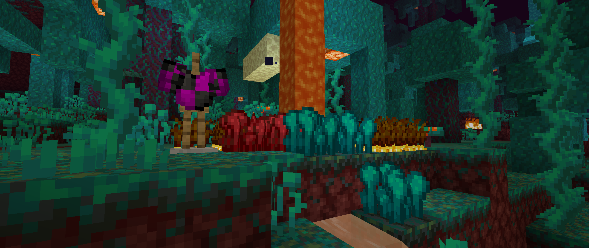

# 
- Variants - 1.7.0 Pre-Release 3 -

### 
A Variants Release Changelog made on *11/04/2024*

## Additions
- Added Crimson and Warped Farmland.
  - Hydrated with Lava instead of Water.
  - Can be tilled from Crimson and Warped Nylium respectively.
  - Only Golden Carrots can be planted here -- this is due to vanilla only allowing crops to be planted on Farmland (and me forgetting to run the data generators).
- Added a new map color: #63 **PAINTING** (#956B2C).
- Added `showTagsWithAlt` config.
  - Controls whether item NBT is shown when pressing Alt. Disabled by default.
    - Also required advanced tooltips (**F3 + H**) to be on.
- Added *"Knowledge Books Used"* statistic (currently unstranslated).
  - Awarded when using Enchanted Knowledge Books.
- Added a `hide_vs_tooltips` tag to Wool Sweaters, Exponential Stews and Horse Armor.
  - This tag has a few sub-tags that hides specific tags on items, those being:
  - `hide_compat_mod`: Hides the *"Item/Block compatibility between: \<x>"* tooltip from any compatibility item or block.
  - `hide_armor_design`: Hides the *"Armor Design: \<x>"* tooltip from Wool Sweaters.
  - `hide_bowl_name`: Hides the *"Bowl: \<x>"* tooltip from Exponential Stews.
  - `hide_horse_armor_armor_points`: Hides the *"When on Horse:"* tooltip from Horse Armor.
- Added a top texture for a Honeyed Piston.
  - Won't be added until update 1.8.

### Technical Additions
- Added a Biome Reports Data Generator.
  - Works mostly the same as the vanilla biome reports generator, except that only biomes in Variants' namespace are saved, and it is saved on *"reports/worldgen/biome"* instead of *"reports/biomes"*.
- Added an *"addVillagerFoodItem(Item, int)"* method to *VSClientHelpers*.
  - Adds an *item* with its respective *foodPoints* to a map in *VillagerEntity*.
  - In other words, it makes an item eatable by Villagers.
- Variants now has an update checker.

## Changes
- Ender Farmland no longer turns into Dirt when placed below a block.
- Emerald armor now shows as being repairable with Emeralds on the anvil JEI category.
- Mushroom Stew Buckets can no longer place down Mushroom Stew.
  - This is a temporary fix for [VS-5](https://github.com/Fabricio20106/Variants/issues/5): *"Mushroom Stew can be duplicated with the stew bucket"*.
- Updated side textures for Ender Nylium, Farmland, and Nylium Quartz Ore.
- Updated top shoulder texture on Glitched Wool Sweaters (also removed cap and boots textures).
- Updated map colors for all Variants' blocks.
  - I was going to put a list of the old and new colors, but it's way too much work.

### Technical Changes
- Updated Gradle workspace to use the updated one from Forge 36.2.41.
  - Specification Title is now the mod id instead of the mod name.
- *ExponentialStewRecipeBuilder* error message now says "Stew Shapeless Recipe" instead of "Bowl Shapeless Recipe".
- The default color for *IDyeableWoolArmorItem* can now be defined with a method called *"getDefaultColor()"*, which for *WoolArmorItem* is 16777215.
- When using armor designs, the default armor material is no longer hardcoded to be "wool" -- it's now dependent on the defined armor.
  - Will still return "wool" if the armor material doesn't have a namespace (more especifically, something behind a ':').

## Tags
- Added `#melony:can_spawn_on_leaves` entity type tag.
  - Contains Ocelots and Parrots.
- Added Crimson and Warped Farmland to `#melony:farmland` block tag.
- Added Golden Carrots to `#melony:villager_wanted_items` item tag.