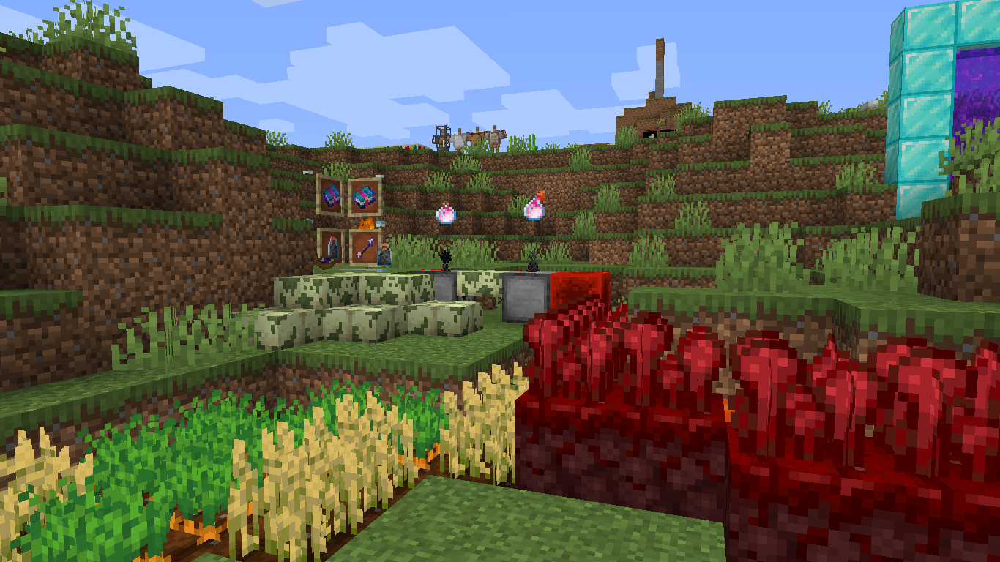

# 
- Variants - 1.7.0 Pre-Release 4 -

### 
A Variants Release Changelog made on *30/05/2024*

## Additions
- Added Debug Arrows
  - These arrows, when shot, change the state of a block.
  - Only changes the state of the block only if the player is in creative, or it's a mob shooting it.
  - These have a `debug_arrow_state` tag that stores their state properties, like the Debug Bow.
  - Like with the Debug Bow, it can be crafted with Debug Sticks.
- Added `stew_behavior` and `poisoning_type` registries.
  - These two registries control, respectively, the behavior of exponential stews and poisoning types of stylised pots.
  - Can be referenced within the item's NBT to set what behavior the item has.
    - For example, a Gunpowder Pot with a `poisoning_type` of `variants:glowstone` will give Glowstone Poisoning instead of Gunpowder Poisoning.
  - Are currently hardcoded, but may become data-driven in the future (will be a bit complicated).
- Moog City (1) now plays in the main menu.
- *"Knowledge Books Used"* statistic is now translated.

## Changes
- Small Soul Fireballs, Splash Dragon's Breath and Lingering Dragon's Breath projectiles now actually render.
- Dispensers now have an `orientation` block state.
  - Behaves (theoretically) like the Crafter's placement, except it's totally broken.
  - Controls how the dispenser looks, removing the up- and down-facing block variants.
  - The `facing` state still exists and controls where the dispenser shoots.
- Error and exception messages are now translated.
- Toolsmiths no longer sell Magma Swords. Instead, Weaponsmiths sell them now.
- Cauldron items from **The Mato** now show up as 3D.
- Mossy End Stone Brick Slabs now drop.

### Technical Changes
- Downgraded the Gradle workspace version.
  - This was done so the mod jar doesn't crash anymore.
- Split *VSClientHelpers* into *VSVanillaCompatibility* and *VSUtils*.
- Updated the Variants update checker so now it actually works.

## Tags
- Added `#melony:hydrates_farmland/water` fluid tag.
  - Contains `#minecraft:water`.
  - Fluids in this tag can be used to hydrate water-based farmland, like Ender and Aljamic Farmland.
- Added `#melony:hydrates_farmland/lava` fluid tag.
  - Contains `#minecraft:lava`.
  - Fluids in this tag can be used to hydrate lava-based farmland, like Crimson and Warped Farmland.
- Added Debug Arrows to `#minecraft:arrows` item and entity type tags.
- Added Crimson and Warped Farmland to `#variants:nether_wart_plantable_on` block tag.
